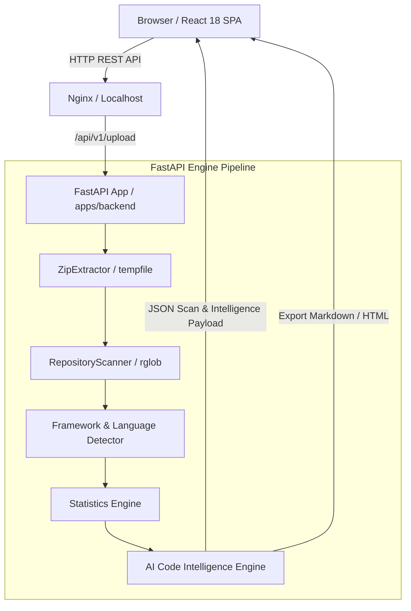

# Coding AI Agent - AI Code Intelligence Platform

[](https://github.com/)
[](https://opensource.org/licenses/MIT)
[](https://fastapi.tiangolo.com)
[](https://react.dev)
[](https://www.typescriptlang.org/)
[](https://tailwindcss.com)

**Coding AI Agent** is a production-grade, monorepo SaaS platform for automated repository scanning, AST file extraction, multi-language detection, framework dependency auditing, calculated health scoring, and generative AI architectural reports.

---

## 🌟 Key Features

- **⚡ Repository Scanner Engine:** High-performance recursive scanner with contextual `.zip` extraction and automated ignore filtering (`node_modules`, `.git`, `dist`, `.venv`, `.next`, build caches).
- **📊 Calculated Health Score Radar (0-100):** Evaluates repository quality across 8 key axes: Folder Structure, Project Organization, Documentation, Configuration, Dependency Management, Framework Usage, Repository Size, and Language Distribution.
- **🏗️ Architectural Analysis:** Detects architectural style (*Monorepo*, *SPA + API*, *Microservice*, *Modular Package*), scale rating, complexity rating, layer separation score, strengths, weaknesses, and potential risks.
- **🛠️ Technology Intelligence:** Audits framework maturity, version compatibility status, deprecated technology detection, and suggested upgrades.
- **🚨 Prioritized Engineering Recommendations:** Categorized finding cards (**Critical**, **High**, **Medium**, **Low**) detailing title, issue description, why it matters, and suggested solutions.
- **📈 Interactive Visual Analytics:** Recharts Donut Pie language distribution chart, expandable repository file tree explorer, and top 10 largest files table.
- **📄 Multi-Format Report Exporter:** 1-click downloads for JSON data (`.json`), formatted Markdown (`.md`), and standalone styled HTML (`.html`) reports.

---

## 🏗️ System Architecture



---

## 🚀 Quick Start Guide

### Prerequisites
- Node.js >= 20.0.0 & pnpm >= 9.0.0 (or `npx pnpm`)
- Python >= 3.12

### 1. Install Dependencies & Setup Environment

```bash
# Clone the repository
git clone https://github.com/your-org/coding-ai-agent.git
cd coding-ai-agent

# Install frontend TS packages
npx pnpm install

# Install backend Python packages
cd apps/backend
pip install -r requirements.txt
```

### 2. Run Local Development Servers

#### Launch Backend API Server (Port 8000)
```bash
cd apps/backend
python -m uvicorn app.main:app --host 127.0.0.1 --port 8000 --reload
```
*Access FastAPI Swagger Docs at:* `http://127.0.0.1:8000/docs`

#### Launch Frontend SaaS Application (Port 5173)
```bash
npx pnpm --filter @coding-ai/frontend dev --host 127.0.0.1 --port 5173
```
*Access SaaS Dashboard at:* `http://127.0.0.1:5173`

---

## 📡 API Reference Summary

| Method | Endpoint | Description |
| :--- | :--- | :--- |
| `POST` | `/api/v1/upload` | Upload `.zip` repository, execute scan, return full analysis & AI intelligence |
| `GET` | `/api/v1/statistics/{id}` | Retrieve statistics and file metrics for workspace ID |
| `GET` | `/api/v1/frameworks/{id}` | Retrieve primary framework and all detected tooling for workspace ID |
| `GET` | `/api/v1/languages/{id}` | Retrieve language distribution for workspace ID |
| `GET` | `/api/v1/summary/{id}` | Retrieve executive summary and recommendations for workspace ID |
| `GET` | `/api/v1/report/{id}/markdown` | Download formatted Markdown report (`.md`) |
| `GET` | `/api/v1/report/{id}/html` | Download styled HTML report (`.html`) |

---

## 🗺️ Product Roadmap

- [x] **Phase 1:** Core Repository Scanner Engine & Zip Extractor
- [x] **Phase 2:** Single Unified FastAPI Backend & Endpoint Wiring
- [x] **Phase 3:** React + TypeScript + Tailwind + Recharts SaaS Dashboard
- [x] **Phase 4:** AI Code Intelligence Engine & Calculated Health Scores
- [x] **Phase 5:** Multi-Format Exporters (JSON, Markdown, HTML)
- [ ] **Phase 6:** Remote Git URL cloning (`git clone --depth 1`)
- [ ] **Phase 7:** PostgreSQL Database Persistence & User Authentication

---

## 📄 License
Released under the [MIT License](LICENSE).
