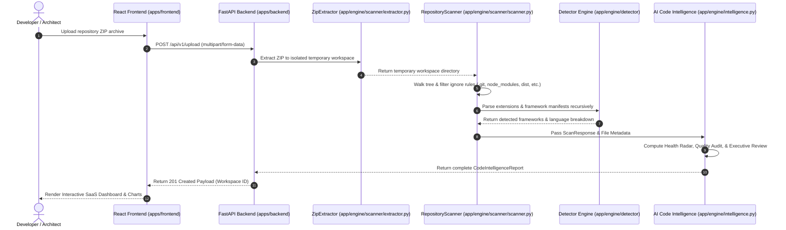

# System Architecture

This document describes the high-level architecture, module boundary isolation, and execution pipelines of the **Coding AI Agent** system.

## 1. System Architecture Diagram

## 2. Module Boundaries

The project is structured into two completely isolated applications under `apps/`:

### `apps/frontend` (Client Layer)
- Built with **React 18**, **Vite 6**, **TypeScript 5**, and **Tailwind CSS 3.4**.
- Manages single-page UI rendering, drag-and-drop uploads, analyzing states, Recharts radar charts, file tree exploration, and multi-format report exports (JSON, Markdown, HTML).
- Communicates with backend via Axios client targeting `/api/v1`.

### `apps/backend` (Server & Engine Layer)
- Built with **FastAPI** and **Python 3.12+**.
- Houses the core repository processing engine under `app/engine/`:
  - `scanner`: Context-managed ZIP extractor and recursive directory scanner.
  - `detector`: Language extension parser and monorepo framework manifest detector.
  - `statistics`: Derived file size and count metrics.
  - `intelligence`: Calculated health scoring (0-100), quality audit checklist, developer insights, and executive summaries.
